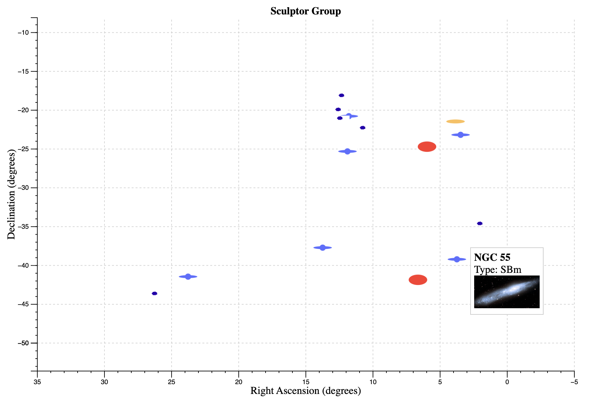

# Maps of the universe

Last updated: Sep 28th 2026

  
   
  <em>Simple map of the nearby Sculptor galaxy group using d3.js</em>
   
  <em>Mousing over a galaxy icon brings up an image</em>

As a former astrophysicist now doing geospatial work, and with modern sky survey datasets reaching billions of objects, an obvious combination of capabilities is to make maps of the universe at various scales. This interdisciplinary application is not widely explored online, with maps by scientists tending to be below GIS standards, and high-quality renditions tending not to be scientific. We use several astronomical datasets and d3.js to create the maps.

## DRAFT

This project is is a draft state, not yet complete.

## Plan

7 scales on which to plot have own map characteristics

- Solar system:        Out to Oort cloud, no other stars, ~ 1ly, 2D
- Local stars:         All stars nearby sun, ~ 10ly, 3D
- Local galaxy:        Interesting objects in local arm, ~ 1000ly, 2D in disc
- Galaxy:              MW disc, no other galaxies, 2D
- Local group:         All LG galaxies, no LSS, ~ 10m ly, 3D?
- Local supercluster:  Galaxies beyond LG out to Laniakea, dist not z, groups
- Superclusters:       SC, filaments, walls to homogeneity scale, z ok if FOG-corrected

+ maybe galaxy groups, clusters, globular clusters, open clusters, galaxies bound to MW (aot. M31)

Main task is construct the types of maps, then different datasets can be plotted

- 2D map
- 3D map
- ra+dec+dist -> l+b, X+Y+Z
- Object icons
- Points, areas

Assume real not z space -> PostGIS can do 2D X Y and 3D X Y Z (EWKT and EWKB if WKT/WKB needed)
